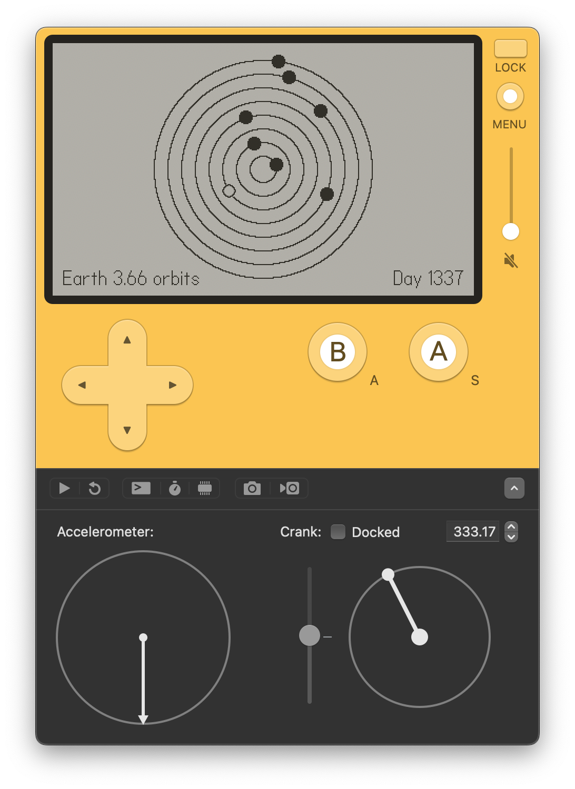

# PlaydateGame003

## Unnamed Solar System Simulator/Toy

While technically not a game, I managed to make something out of the [Playdate SDK](https://play.date/dev/) while waiting for my device to arrive (hopefully by the end of this year)

Note: If while developing for the [Playdate](https://play.date/) you feel you're wasting 90% of your time Googling and fighting with Lua's quirks, you are not alone

### Usage

- Launch the game in the **Playdate Simulator** (or a real device, if you're lucky)
- Spin the **crank** to **advance the days**
- Press **up** or **down** to **magnify** or **shrink** the solar system
- Press **left** or **right** to **change planet** and display its **number of revolutions**
- Press **a** to turn the **auto-crank on/off**
- Press **b** to **hide/show** the **user interface**

